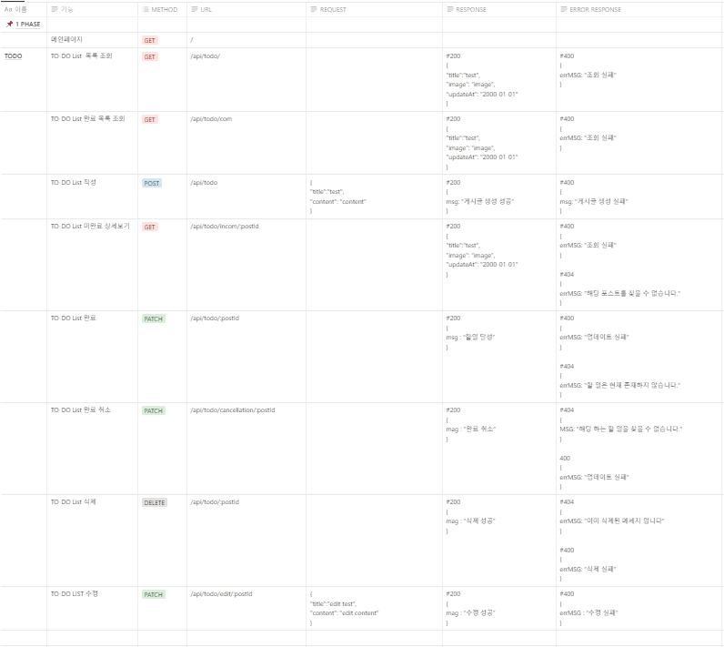

# To-Do List 사이트 제작 (Back-End)

---

#### 프로젝트명 : Daily To-Do
- 프로젝트 기간 : 2023.07.14 ~ 2023.07.20
- 프로젝트 설명 : To-Do List 해야 할 작업 정리하는 사이트
  |  멤버  |        역할      |
  | :----: | :-------------: |
  | 김형섭 | CI/CD / HTTPS   |
  | 김대욱 | TO-DO List CRUD |
- [Frontend-End] https://github.com/gunhoray/Daily-Frontend
### 개발 환경

📚 Tech Stack 📚

⭐ Platforms & Languages ⭐

  
  
  
  
  
  
  
 
  
  
  
  
  
 
 

🛠 Tools 🛠

### 시연 영상

[유튜브 시연영상] https://youtu.be/vG5H-wJiYEE

### API 명세서

